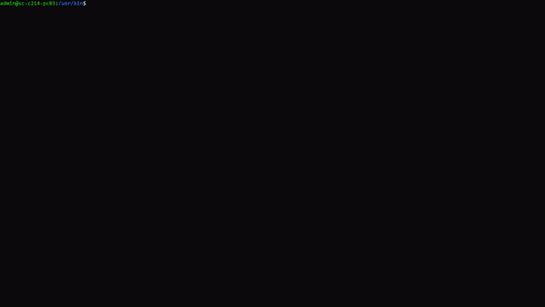

# ScrollSh
## Description
ScrollSh is a script for scrolling through text of your choice with an animation. 

## Demonstration 


## Installation
### Download packages
```git 
git clone https://github.com/Thibault343/ScrollSh.git
```
### Script Intall
```bash
cd ScrollSh
sudo chmod +x ./install.sh
./install.sh
```

## Usage
### words
```bash
scroll.sh [word]
```
### Phrases
```bash
scroll.sh "[phrases]"
```
### Exemples
```bash
scroll.sh Hello
```
```bash
scroll.sh "Hello World!"
```
## Parameters
### colors
```bash
scroll.sh "Hello World!" -c red
```
Colors table

| Color             |                                                             
| ----------------- | 
| red| 
| black| 
| green| 
| yellow| 
| blue| 
| magenta| 
| cyan| 
| white| 
| gray| 
|dark_red|
| dark_green| 
| dark_yellow| 
| dark_blue| 
| dark_magenta| 
| dark_cyan| 
| dark_white| 


